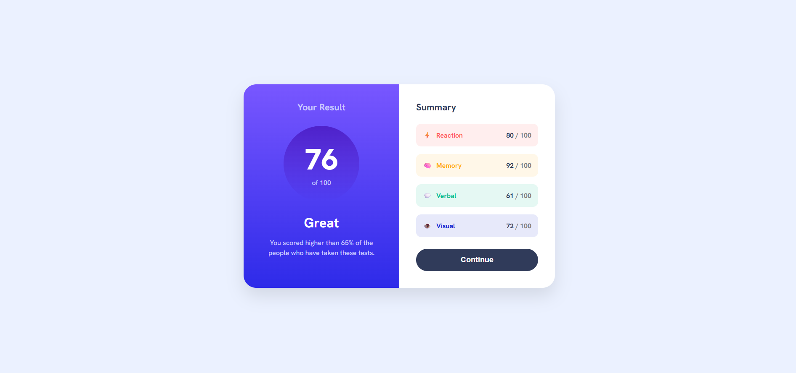

<<<<<<< HEAD
# Results Summary Component

A responsive **Results Summary Component** built with **HTML5** and **CSS3** as part of a Frontend Mentor challenge.

## 🚀 Features

- Semantic HTML5
- Modern CSS3
- Flexbox Layout
- Gradient Backgrounds
- Hover Effects
- Fully Responsive Design
- Clean & Organized Code

## 🛠️ Built With

- HTML5
- CSS3

## 📸 Preview



## 📂 Project Structure

```
├── index.html
├── style.css
└── README.md
```

## 🎯 Challenge

This project is based on a Frontend Mentor challenge to practice responsive layouts and modern CSS styling.

## 👨‍💻 Author

**Mohamed**
=======
# results-summary-component
A responsive Results Summary Component built with HTML5 and CSS3 as part of a Frontend Mentor challenge. The project focuses on semantic HTML, Flexbox layout, modern CSS styling, gradients, and a fully responsive design for all screen sizes.
>>>>>>> cbed65fd9f5d3b740fd6a40bcf7ba384ed10816b
